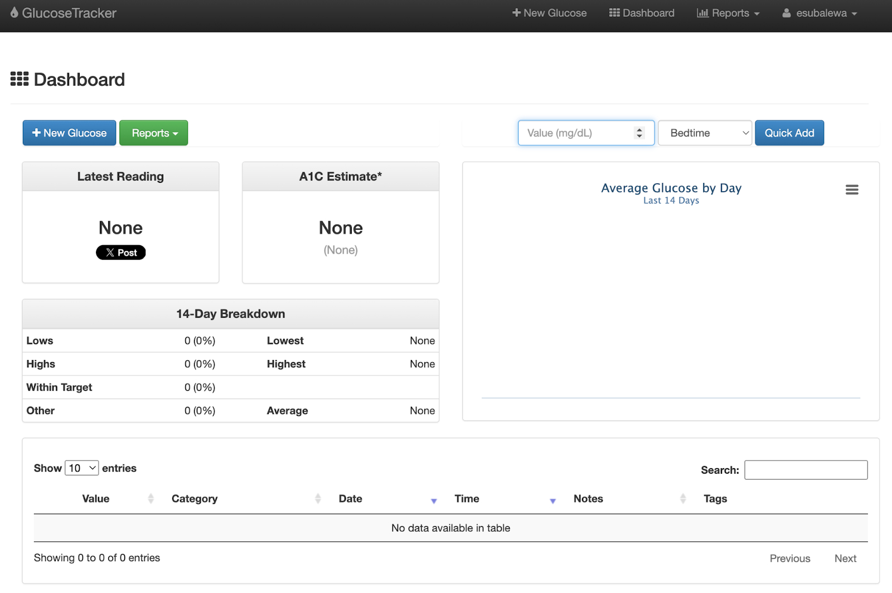
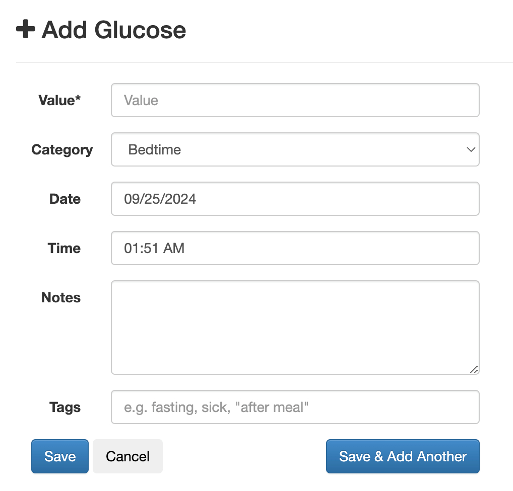

# Glucose Guardian: A Django-Based Blood Glucose Tracker


**Glucose Guardian** is a user-friendly web application built with Django to help individuals securely track, manage, and share their blood glucose data. It provides essential tools for monitoring health trends and facilitating better communication with healthcare providers.

The application is fully open-source, mobile-friendly, and designed with data privacy and ease-of-use in mind.

---

## ✨ Key Features

* **Comprehensive Tracking:** Log blood glucose readings with date, time, and relevant notes.
* **A1C Estimation:** Automatically calculates an estimated A1C based on your logged data to track long-term trends.
* **Advanced Data Filtering:** Easily filter and view your data by date range or time of day (e.g., "before breakfast," "after lunch").
* **Data Import/Export:**
    * **Import:** Easily import your existing glucose data from a CSV file.
    * **Export:** Generate and download your health reports in both **CSV** and **PDF** formats.
* **Secure Sharing:** Share your generated PDF reports directly with your healthcare provider via email.
* **Responsive Design:** A clean and adaptive interface that works seamlessly on both desktop and mobile devices.

---

## 🛠️ Technology Stack

* **Backend:** Python 3.x, Django Framework
* **Database:** SQLite (default, easily configurable)
* **Frontend:** HTML5, CSS3, JavaScript
* **Key Python Libraries:**
    * `pandas` for data manipulation (CSV import/export).
    * `reportlab` for PDF generation.

---

## 🚀 Getting Started

Follow these instructions to get a local copy of the project up and running for development and testing purposes.




### Prerequisites

* Python 3.8 or higher
* pip (Python package installer)
* Git

### Installation & Setup

1.  **Clone the repository:**
    ```sh
    git clone https://github.com/EsubalewAmenu/Glucose-Tracker.git
    cd Glucose-Tracker
    ```

2.  **Create and activate a virtual environment:**
    * On macOS/Linux:
        ```sh
        python3 -m venv venv
        source venv/bin/activate
        ```
    * On Windows:
        ```sh
        python -m venv venv
        .\venv\Scripts\activate
        ```

3.  **Install the required dependencies:**
    ```sh
    pip install -r requirements.txt
    ```

4.  **Apply database migrations:**
    ```sh
    python manage.py migrate
    ```

5.  **Create a superuser to access the admin panel (optional):**
    ```sh
    python manage.py createsuperuser
    ```
    Follow the prompts to create your admin account.

### Running the Application

1.  **Start the Django development server:**
    ```sh
    python manage.py runserver
    ```

2.  **Open your web browser** and navigate to `http://127.0.0.1:8000/` to see the application in action.

---

## 🤝 How to Contribute

Contributions are what make the open-source community such an amazing place to learn, inspire, and create. Any contributions you make are **greatly appreciated**.

If you have a suggestion that would make this better, please fork the repo and create a pull request. You can also simply open an issue with the tag "enhancement".

1.  **Fork the Project**
2.  **Create your Feature Branch** (`git checkout -b feature/AmazingFeature`)
3.  **Commit your Changes** (`git commit -m 'Add some AmazingFeature'`)
4.  **Push to the Branch** (`git push origin feature/AmazingFeature`)
5.  **Open a Pull Request**

---

## 📜 License

This project is distributed under the MIT License. See `LICENSE.txt` for more information.
